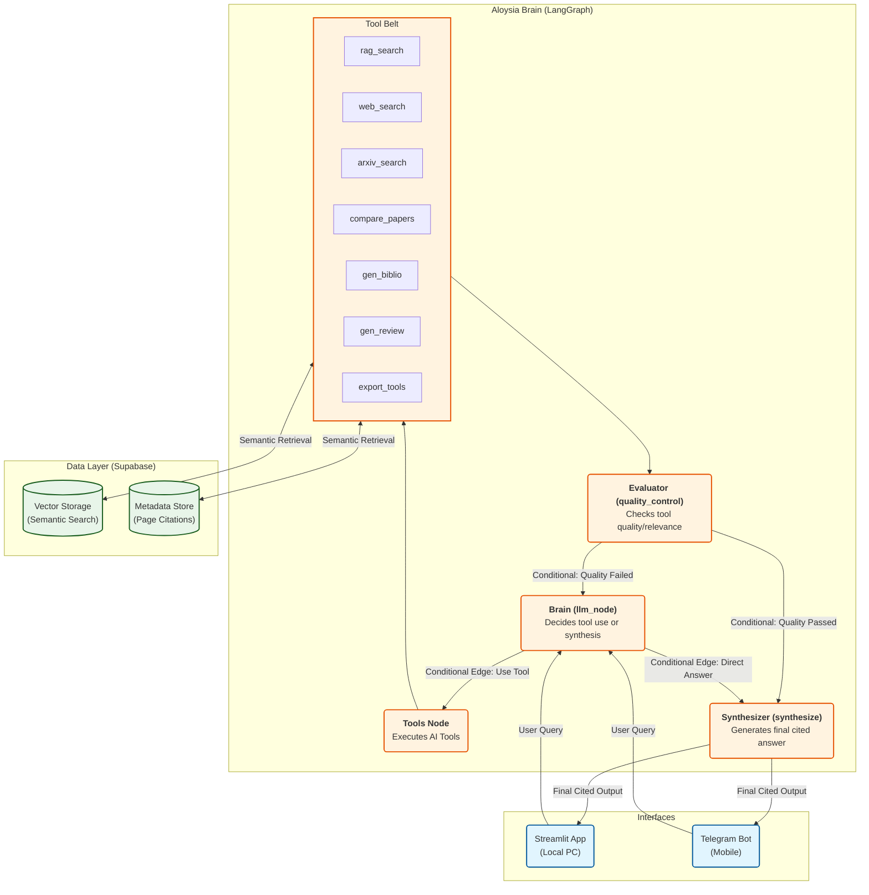

# Aloysia — Agentic Research Assistant

**Aloysia** is a production-ready, agentic research assistant that turns your PDFs, DOCX, and text files into a **page-aware, citation-rich knowledge base**. Powered by **Supabase & LangGraph**, it autonomously decides when to search documents, compare papers, or fetch real-time web data, all with **academic-grade citations**.

Built for researchers, clinicians, and students on the go, Aloysia follows a **Mobile-First/Telegram-First** architecture, allowing you to manage and query your research library directly from your pocket or your PC.

---

## The Architecture
Aloysia uses a split architecture:

1.  **Cloud Portal (Render)**: Runs the **Telegram Bot** and a lightweight **HTTP Gateway** that redirects all web traffic to Telegram.
2.  **Local Dashboard (Your PC)**: Run the beautiful **Streamlit UI** locally to manage your library with rich visuals and batch tools.
3.  **Unified Knowledge Base (Supabase)**: Both platforms share the same cloud database. A paper uploaded on your PC is instantly searchable on your phone.

---

## What Aloysia Does

| Feature | Platform | Description |
| :--- | :--- | :--- |
| **Page-level RAG** | Both | Factual answers with `Source: file.pdf, Page: 12` |
| **Agentic Workflow** | Both | Autonomously chooses between 9+ research tools |
| **Mobile Research** | Telegram | Search, summarize, and upload papers on the go |
| **Rich Dashboards** | Web (Local) | Literature reviews, bibliographies, and batch uploads |
| **Account Sync** | Both | Sync Telegram ID with your email via `/link` |
| **Enterprise Security**| Supabase | Row Level Security (RLS) ensures data isolation |

---


## How It Works (Agentic Workflow)



---

## Project Structure
```bash
aloysia/
├── code/
│   ├── gateway_runner.py   # Render Entry Point (Bot + Redirector)
│   ├── telegram_bot.py     # Mobile Bot Interface
│   ├── streamlit_app.py    # Desktop Research Dashboard
│   ├── agent.py            # LangGraph agent & tool definitions
│   ├── db.py               # Supabase & Gemini Embedding logic
│   ├── rag_init.py         # RAG Caching & Initialization
│   └── app.py              # Document processing & extraction
├── requirements.txt        # Core dependencies
└── .env                    # Private API keys
```

---

## Installation & Setup

### 1. Clone & Environment
```bash
git clone https://github.com/Nago-01/aloysia.git
cd aloysia
python -m venv .venv
source .venv/bin/activate  # or .venv\Scripts\activate on Windows
pip install -r requirements.txt
```

### 2. Configure `.env`
Create a `.env` file with these keys:
```env
# AI Brain
GROQ_API_KEY=your_key
GEMINI_API_KEY=your_key # Required for embeddings

# Database (Supabase)
SUPABASE_URL=your_url
SUPABASE_KEY=your_anon_key
SUPABASE_SERVICE_ROLE_KEY=your_service_role_key

# Integrations
TELEGRAM_BOT_TOKEN=your_bot_token
TAVILY_API_KEY=your_tavily_key
```

---

## Usage

### On Telegram
Users will interact with **@Aloysia_telegram_bot**. 
- **Start**: Send `/start` to get on-boarded.
- **Upload**: Forward any PDF/docs/txt files to the bot to index it.
- **Sync**: Send `/link your@email.com` to connect to your web identity.

### Local Management (Web UI)
To manage your documents or generate rich literature reviews:
```bash
# From the project root
streamlit run code/streamlit_app.py
```
→ Upload files via sidebar → chat + use tools

### Example Session
```
Agentic RAG Assistant with LangGraph
Initializing agent...
Loaded 3 documents into knowledge base.

You: Compare AMR and PCOS papers on treatment options
Assistant: 
COMPARISON: antimicrobial_resistance.pdf vs pcos_clinical_guidelines.docx on 'treatment'

AMR.pdf:
1. Source: antimicrobial_resistance.pdf, Page: 12, Author: WHO
   "Antibiotic stewardship programs reduced resistance by 23%..."

PCOS.docx:
1. Source: pcos_clinical_guidelines.docx, Page: 8, Author: AES
   "Metformin and lifestyle intervention improved ovulation in 68%..."

You: Write a literature review on antimicrobial resistance and export as Word
Aloysia: Literature review exported to WORD: literature_review_antimicrobial_resistance.docx

You: What’s the latest WHO stance on AMR?
Aloysia: [Uses web_search] According to WHO (Nov 2025): "Global AMR deaths projected to reach 10M by 2050..."
```


### Example Queries (Natural Language)

| Ask This | Aloysia Does This |
|----------|-------------------|
| `"What does the AMR paper say on page 5?"` | `rag_search` with citation |
| `"Compare AMR and Dysmenorrhea on causes"` | `compare_documents` |
| `"Show bibliography"` | `generate_bibliography` |
| `"search arxiv for..."` | `arxiv_search` |
| `"Export references as LaTeX"` | `export_bibliography(format="latex")` |
| `"Write a review on PCOS"` | `generate_literature_review` + synthesis |
| `"Save review as Markdown"` | `export_literature_review(format="md")` |
| `"Calculate 68% of 250 patients"` | `calculator` |


### Tools Available to the Agent

| Tool | Trigger Phrase Example |
|------|------------------------|
| `rag_search` | Any factual question |
| `compare_documents` | """compare X and Y"", ""difference between...""" |
| `generate_bibliography` | """show sources"", ""list documents""" |
| `generate_literature_review` | """write a review on..."", ""summarize research""" |
| `arxiv_search` | """search arxiv for..."", ""find papers on...""" |
| `export_bibliography` | """export references as Word""" |
| `export_literature_review` | """save review as PDF/Markdown""" |
| `web_search` | Only after confirming with user |
| `calculator` | Math expressions |
| `parallel_document_analysis` | Multi-document deep dives |


### Tech Stack

| Layer | Tool |
|-------|------|
| **LLM** | Groq (`llama-3.3-70b`) or Gemini (`2.0-flash`) |
| **Embeddings** | Gemini (`models/text-embedding-004`) |
| **Vector DB** | Supabase (pgvector) |
| **Agent Framework** | LangGraph |
| **Document Parsing** | PyPDF2, python-docx |
| **Export** | python-docx, LaTeX, Markdown |
| **Web Search** | Tavily |
| **CLI** | Built-in interactive loop |
| **Frontend(Local)** | Streamlit |


## For Health-Tech and Research
- Clinical trial document analysis
- Guideline compliance checking
- Pharmacovigilance reporting
- Medical education content generation
- Real-time drug policy updates
- Rapid literature reviews from documents
- Compare conflicting guidelines side-by-side
- Generate conference-ready bibliographies in multiple formats
- Stay updated with real-time WHO/CDC policy shifts
- Export citable Word/LaTeX documents instantly


## License
MIT

