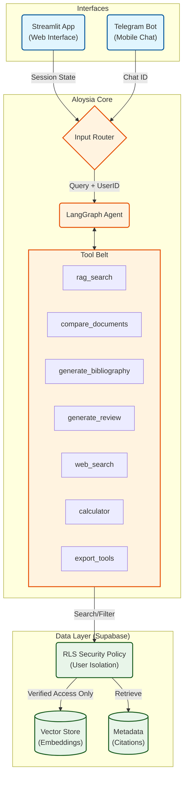

# Aloysia — Agentic Research Assistant with Full-Stack RAG

**Aloysia** is a production-ready, agentic research assistant that turns your PDFs, DOCX, and text files into a **page-aware, citation-rich knowledge base**. Powered by **Supabase & LangGraph**, it autonomously decides when to search documents, compare papers, generate literature reviews, export bibliographies, retrieve papers research archives (ArXiv) or fetch real-time web data, all with **academic-grade citations**.

Built for researchers, clinicians, students, and health-tech teams.

---

## Live Demo & Web UI
**Now with a beautiful Streamlit web interface and Telegram Bot!**  
Run `streamlit run code/streamlit_app.py` → full chat + tools + export UI  
Run `python code/telegram_bot.py` → Chat via Telegram on your phone 

---

## What Aloysia Does

| Feature                        | Status | Description |
|-------------------------------|-------|-----------|
| Page-level RAG + citations    | Done  | Every answer includes `Source: file.pdf, Page: 12` |
| Cross-encoder reranking       | Done  | `ms-marco-MiniLM-L-6-v2` for maximum relevance |
| Agentic workflow (LangGraph)  | Done  | Autonomously chooses tools |
| 9 Smart Tools                 | Done  | Search, compare, review, export, web search, calculator |
| Export bibliography & reviews | Done  | Word • LaTeX • Markdown |
| Real-time web search          | Done  | Tavily-powered (when documents lack info) |
| Streamlit Web UI              | Done  | Chat + sidebar tools + dark theme |
| Telegram Bot Interface        | Done  | Chat & Upload files from mobile |
| Supabase Vector DB (Cloud)    | Done  | Scalable, cloud-native storage |
| Row Level Security (RLS)      | Done  | Multi-user data isolation by User ID |

---


## How It Works (Agentic Workflow)




## Project Structure
```bash
aloysia/
├── code/
│   ├── app.py              # Document loading, metadata extraction, QAAssistant
│   ├── db.py               # Supabase Vector Store + Gemini Embeddings
│   ├── rag_init.py         # Hybrid RAG Cache (Streamlit + Bot support)
│   ├── agent.py            # LangGraph agent, all 9 tools, workflow
│   ├── telegram_bot.py     # Telegram Bot Interface
│   ├── export_utils.py     # Word/LaTeX/Markdown exporters
│   ├── streamlit_app.py    # Web UI (chat + tools + uploads)
│   └── __init__.py
├── data/                   # Put your PDFs, DOCX, TXT, MD here
├── requirements.txt        # Dependencies
└── .env                    # API keys & config
```


## Installation
### 1. Clone the repository
```bash
git clone https://github.com/Nago-01/aloysia.git
cd aloysia
```

### 2. Create virtual environment
```bash
# Unix/macOS
python -m venv .venv
source .venv/bin/activate

# Windows
python -m venv .venv
.venv\Scripts\Activate.ps1
```


### 3. Install dependencies
```bash
pip install -r requirements.txt
```

### Set Up `.env`
```
# LLM Providers (one required)
GROQ_API_KEY=your_groq_key
GROQ_MODEL=llama-3.3-70b-versatile

# OR
GEMINI_API_KEY=your_gemini_key
GEMINI_MODEL=gemini-2.0-flash-exp

# Optional: Real-time web search
TAVILY_API_KEY=your_tavily_key

# Embedding & DB
SUPABASE_URL=your_supabase_url
SUPABASE_KEY=your_supabase_anon_key
SUPABASE_SERVICE_ROLE_KEY=your_service_role_key__for_bot

```

## Usage
### Add Documents
Place your research papers in the `data/` folder
```
data/
├── antimicrobial_resistance.pdf
├── pcos_clinical_guidelines.docx
└── who_amr_report_2025.md
```

### Run Aloysia
#### CLI Agent
```bash
python -m code.agent
```

#### Streamlit Web UI
```bash
streamlit run code/streamlit_app.py
```
→ Upload files via sidebar → chat + use tools

#### Telegram Bot
```bash
python code/telegram_bot.py
```
→ Send `/start` on Telegram
→ Upload PDF/DOCX files directly in chat
→ Ask questions naturally


### Example Session
```
Agentic RAG Assistant with LangGraph
Initializing agent...
Loaded 3 documents into knowledge base.

You: Compare AMR and PCOS papers on treatment options
Assistant: 
COMPARISON: antimicrobial_resistance.pdf vs pcos_clinical_guidelines.docx on 'treatment'

AMR.pdf:
1. Source: antimicrobial_resistance.pdf, Page: 12, Author: WHO
   "Antibiotic stewardship programs reduced resistance by 23%..."

PCOS.docx:
1. Source: pcos_clinical_guidelines.docx, Page: 8, Author: AES
   "Metformin and lifestyle intervention improved ovulation in 68%..."

You: Write a literature review on antimicrobial resistance and export as Word
Aloysia: Literature review exported to WORD: literature_review_antimicrobial_resistance.docx

You: What’s the latest WHO stance on AMR?
Aloysia: [Uses web_search] According to WHO (Nov 2025): "Global AMR deaths projected to reach 10M by 2050..."
```


### Example Queries (Natural Language)

| Ask This | Aloysia Does This |
|----------|-------------------|
| `"What does the AMR paper say on page 5?"` | `rag_search` with citation |
| `"Compare AMR and Dysmenorrhea on causes"` | `compare_documents` |
| `"Show bibliography"` | `generate_bibliography` |
| `"Export references as LaTeX"` | `export_bibliography(format="latex")` |
| `"Write a review on PCOS"` | `generate_literature_review` + synthesis |
| `"Save review as Markdown"` | `export_literature_review(format="md")` |
| `"Calculate 68% of 250 patients"` | `calculator` |


### Tools Available to the Agent

| Tool | Trigger Phrase Example |
|------|------------------------|
| `rag_search` | Any factual question |
| `compare_documents` | """compare X and Y"", ""difference between...""" |
| `generate_bibliography` | """show sources"", ""list documents""" |
| `generate_literature_review` | """write a review on..."", ""summarize research""" |
| `export_bibliography` | """export references as Word""" |
| `export_literature_review` | """save review as PDF/Markdown""" |
| `web_search` | Only after confirming with user |
| `calculator` | Math expressions |
| `parallel_document_analysis` | Multi-document deep dives |


### Tech Stack

| Layer | Tool |
|-------|------|
| **LLM** | Groq (`llama-3.3-70b`) or Gemini (`2.0-flash`) |
| **Embeddings** | Gemini (`models/text-embedding-004`) |
| **Reranking** | `ms-marco-MiniLM-L-6-v2` |
| **Vector DB** | Supabase (pgvector) |
| **Agent Framework** | LangGraph |
| **Document Parsing** | PyPDF2, python-docx |
| **Export** | python-docx, LaTeX, Markdown |
| **Web Search** | Tavily |
| **CLI** | Built-in interactive loop |
| **Frontend** | Streamlit |


## For Health-Tech and Research
- Clinical trial document analysis
- Guideline compliance checking
- Pharmacovigilance reporting
- Medical education content generation
- Real-time drug policy updates
- Rapid literature reviews from documents
- Compare conflicting guidelines side-by-side
- Generate conference-ready bibliographies in multiple formats
- Stay updated with real-time WHO/CDC policy shifts
- Export citable Word/LaTeX documents instantly


## License
MIT

